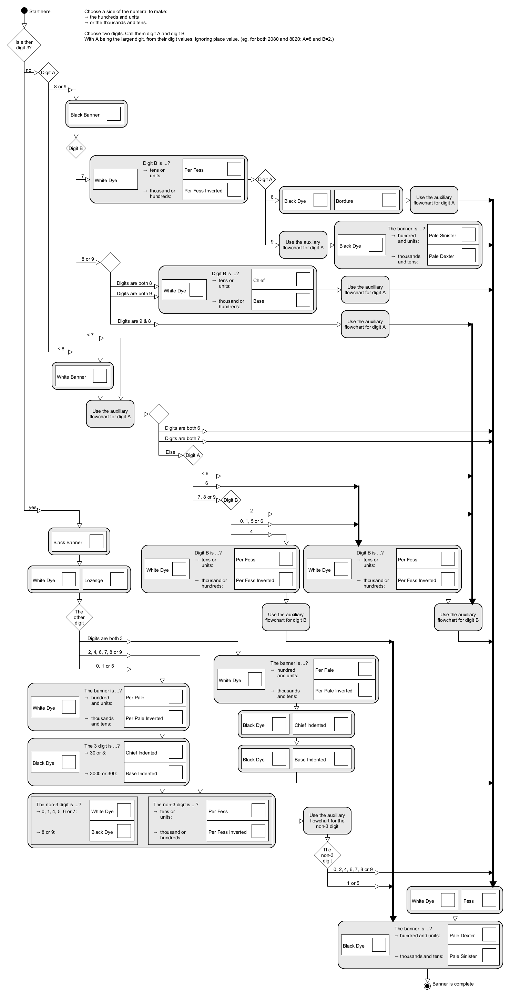
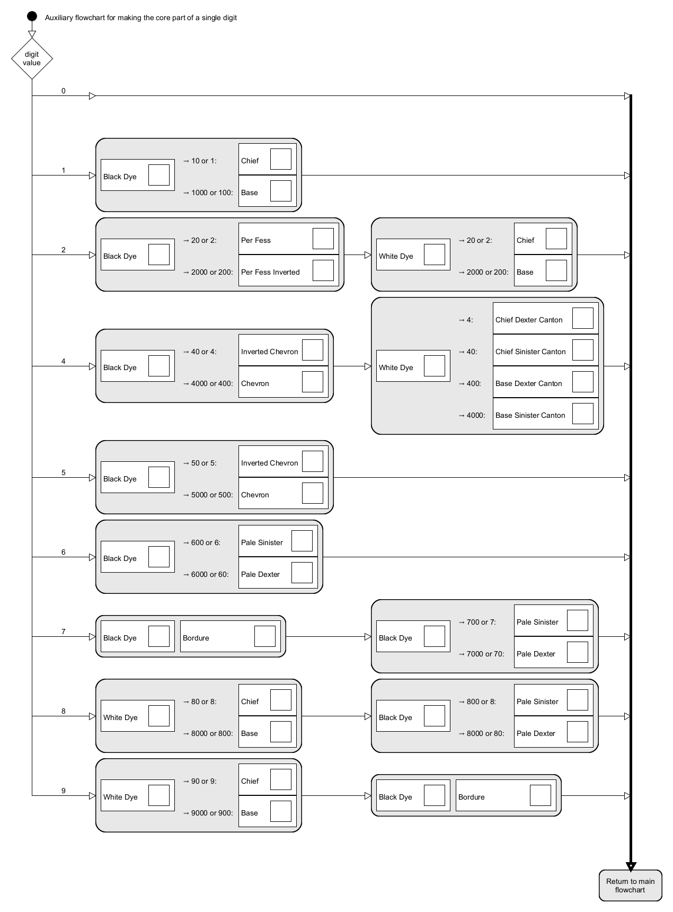

this blog is not complete yet, still to finish writing up

# Cistercian Numerals Minecraft Banners

My repo: [https://github.com/JNCressey/Cistercian-Numerals-Minecraft-Banners](https://github.com/JNCressey/Cistercian-Numerals-Minecraft-Banners)

## Intro

<!-- describe what cistercian numerals are -->

<!-- explain how they allow denser numbers than minecraft arabic numeral banners-->

## Web-Browser Based Interactive Generator

<!-- make the web frontend -->

I made a javascript file that can generate the required banner patterns.

Read the code on GitHub: [https://github.com/JNCressey/Cistercian-Numerals-Minecraft-Banners/blob/main/interactive-app/cistercian-numerals-banner-generator.js](https://github.com/JNCressey/Cistercian-Numerals-Minecraft-Banners/blob/main/interactive-app/cistercian-numerals-banner-generator.js)

## Flowchart

I made a flowchart so that a player can follow it as crafting instructions, without using the interactive generator, with just the flowchart images as references.

To use the flow chart, you first need to decide the digits you will make:

1. Choose a side of the numeral to make:
	- the hundreds and units
	- or the thousands and tens.
2. Choose two digits. Call them digit A and digit B.

	With A being the larger digit, from their digit values, ignoring place value. (eg, for both 2080 and 8020: A=8 and B=2.)

Start at the top of the main flowchart.

When the main flowchart tells you to use the auxiliary flowchart, follow the steps on the other image for the single digit that the main flowchart told you to use. Then return to the main flowchart where you left from.

	
 Main flowchart 

	

	
 Auxiliary flowchart 

	

I used UMLet to draw the flowcharts.